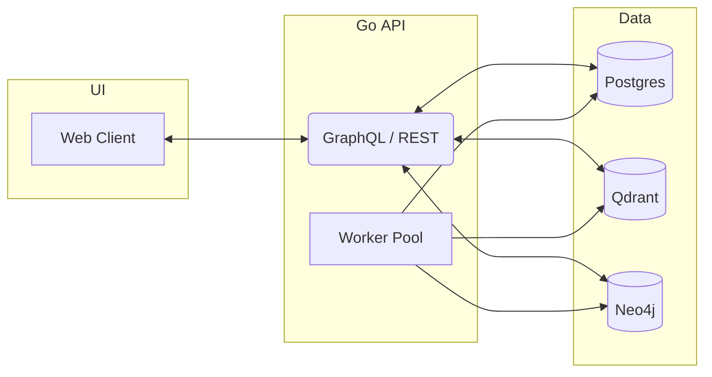

# mem0-go

> **mem0-go** is an open‑source, fully containerized re‑imagining of the core functionality of [mem0.ai](https://mem0.ai) built entirely in Go.
> It combines **Qdrant** for vector search, **Neo4j** for graph relationships, **PostgreSQL** for relational data, and a modern **React + Tailwind** UI—everything runnable with a single `docker compose up`.

---

## ✨ Features

| Area                 | Highlights                                                                                           |
| -------------------- | ---------------------------------------------------------------------------------------------------- |
| **All‑Go Backend**   | Idiomatic Go 1.22 modules, fiber web framework, gqlgen GraphQL & REST, async workers via go‑workers. |
| **Vector Search**    | Qdrant handles embeddings & ANN queries for fast semantic recall.                                    |
| **Graph Memory**     | Neo4j stores entity & context graphs, enabling rich traversal queries.                               |
| **Relational Store** | PostgreSQL persists structured data, events & auth.                                                  |
| **Modern UI**        | React 18, Vite, Tailwind CSS, shadcn/ui components, Zustand state.                                   |
| **Observability**    | OpenTelemetry tracing, Prometheus metrics, Loki logs—pre‑wired.                                      |
| **Container‑first**  | One‑shot local stack via Docker Compose; production Helm charts included.                            |

---

## 🗺️ Architecture Overview



---

## 🚀 Quick Start

### Prerequisites

* Docker 24+ and Docker Compose v2
* `git` ≥ 2.40

```bash
# 1. Clone & enter
$ git clone https://github.com/your‑org/mem0-go.git
$ cd mem0-go

# 2. Copy env template & tweak if needed
$ cp .env.example .env

# 3. Fire up the whole stack 🐳
$ docker compose up -d --build

# 4. Explore
UI          → http://localhost:3000  (Vite dev, hot‑reload)
GraphQL UI  → http://localhost:8080/graphql
Qdrant UI   → http://localhost:6333
Neo4j Browser → http://localhost:7474  (neo4j / neo4jtest)
Postgres    → localhost:5432 (mem0 / mem0pass)
```

Shut everything down with `docker compose down -v`.

---

## 🔧 Configuration

All configuration is environment‑driven. Key variables:

| Variable             | Default     | Purpose                           |
| -------------------- | ----------- | --------------------------------- |
| `POSTGRES_USER`      | `mem0`      | DB user                           |
| `POSTGRES_PASSWORD`  | `mem0pass`  | DB password                       |
| `POSTGRES_DB`        | `mem0`      | DB name                           |
| `QDRANT_PORT`        | `6333`      | Qdrant HTTP port                  |
| `NEO4J_USER`         | `neo4j`     | Neo4j user                        |
| `NEO4J_PASSWORD`     | `neo4jtest` | Neo4j password                    |
| `MEM0_EMBEDDING_KEY` | *‑empty‑*   | OpenAI / LM Studio key (optional) |

Create additional overrides in `docker/.env.local` which is `.gitignore`d.

---

## 🏗️ Project Layout

```
mem0-go/
├── cmd/               # Entrypoints (api, worker, migrator)
├── internal/
│   ├── config/        # Viper‑based config loader
│   ├── db/            # Postgres & migrations
│   ├── graph/         # Neo4j adapters
│   ├── vector/        # Qdrant adapters
│   └── memory/        # Core domain logic
├── pkg/               # Reusable libs
├── ui/                # React front‑end
├── docker/            # Compose & service configs
└── charts/            # Helm for k8s deployment
```

---

## 🧪 Development Workflow

```bash
# Run unit tests
$ make test

# Lint & vet
$ make lint

# Launch API only (uses local services already running via compose)
$ make dev
```

Front‑end hot‑reload:

```bash
$ cd ui && pnpm i && pnpm dev
```

---

## 📡 API Reference

On startup the API serves **OpenAPI 3** & **GraphQL Playground** at `/docs` & `/graphql`.
Generated clients live under `pkg/clients`.

---

## 🤝 Contributing

1. Fork 🔀 → Feature branch → PR
2. Ensure `make ci` passes.
3. Follow Conventional Commits (`feat:`, `fix:` …) for clean changelogs.

Need help? Open a discussion or ping @maintainers.

---

## 🪪 License

**mem0-go** is released under the [MIT License](LICENSE).


## Development

A minimal Fiber web server is provided under `cmd/api`. Run it with:

```bash
make dev
```

The server exposes a single `GET /healthz` endpoint that returns `{"status":"ok"}`. It includes structured request logging and shuts down gracefully when interrupted.

Run tests with `make test` and lint with `make lint`. Build a Docker image
using `make docker-build`.
